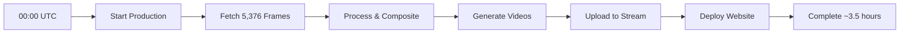

# 🌞 Heliosphere

**Living Portrait of Our Sun's Corona - Real-Time Solar Observatory**

Heliosphere is an immersive solar visualization platform that transforms 56 days of solar activity into a mesmerizing 56-second experience. Witness coronal mass ejections, solar flares, and the ever-changing architecture of our star's million-degree atmosphere, updated daily from NASA spacecraft.

## ✨ Key Features

- **🛰️ Multi-Spacecraft Imaging**: Combines SOHO/LASCO C2 coronagraph with SDO/AIA 171Å extreme ultraviolet
- **🎨 Cinema-Quality Processing**: Advanced color grading, circular feathering, and professional compositing
- **⚡ Optimized Performance**: 3x faster with parallel processing (27.5 frames/minute)
- **🌐 Global Distribution**: Automatic upload to Cloudflare Stream with adaptive bitrate
- **📱 Responsive Formats**: Desktop (1460×1200) and mobile portrait (1080×1350) versions
- **🔄 Intelligent Fallbacks**: ±15 minute data recovery for missing frames
- **📊 Production Monitoring**: Real-time web dashboard with performance metrics
- **♿ Full Accessibility**: ARIA labels, semantic HTML, screen reader support
- **🔬 Scientific Accuracy**: Preserves data fidelity for research and education

## 🚀 Quick Start

### Prerequisites
- Node.js 20+ 
- FFmpeg with H.264 support
- 10GB+ storage for frames/videos
- Cloudflare account with Stream API access

### Installation

```bash
# Clone repository
git clone https://github.com/yourusername/heliosphere.git
cd heliosphere

# Install dependencies
npm install

# Copy environment variables
cp .env.example .env
# Edit .env with your Cloudflare tokens

# Run test (2 days of data)
node vps_optimized_test.js

# Monitor progress
# http://localhost:3003/monitor
```

### Production Deployment

```bash
# SSH to production VPS
ssh root@your-vps-ip

# Deploy with PM2
pm2 start vps_production_optimized.js --name heliosphere
pm2 save
pm2 startup

# Set up daily cron
echo "0 0 * * * cd /opt/heliosphere && node vps_production_optimized.js" | crontab -
```

## 📊 Performance

| Metric | Sequential | Optimized |
|--------|------------|-----------|
| Processing Rate | 9.3 fps | 27.5 fps |
| Full Production (5,376 frames) | 9.6 hours | 3.5 hours |
| Concurrency | 1 | 8 fetch, 4 process |
| Speed Improvement | 1x | 3x |

## 🎬 Output Specifications

### Desktop Video (Landscape)
- **Resolution**: 1460×1200
- **Frames**: 5,376 (56 days × 96 frames/day)
- **Duration**: 3:44 @ 24fps (or 56 seconds looped)
- **Encoding**: H.264, CRF 8-15, veryslow preset
- **Bitrate**: ~15-20 Mbps for maximum quality
- **File Size**: ~400-500 MB

### Mobile Video (Portrait)
- **Resolution**: 1080×1350 (9:16 crop)
- **Frames**: Same as desktop
- **Duration**: Same as desktop
- **Optimization**: TikTok, Instagram Reels, YouTube Shorts
- **Coverage**: 30% more visible area on mobile devices

## 🛠️ Architecture

### Core Technologies
- **Runtime**: Node.js 20+ with ES modules
- **Image Processing**: Sharp.js (libvips-based, SIMD optimized)
- **Video Encoding**: FFmpeg 6+ with x264 encoder
- **CDN**: Cloudflare Stream & Pages
- **Process Management**: PM2 with cluster mode
- **Monitoring**: Express.js + Server-Sent Events

### Processing Pipeline
1. **Data Acquisition**: Parallel fetch from Helioviewer API
2. **Image Processing**: Multi-threaded Sharp operations
3. **Quality Validation**: Automated frame analysis
4. **Video Generation**: FFmpeg with optimized encoding
5. **Distribution**: Direct upload to Cloudflare Stream
6. **Deployment**: Automated Pages deployment with SEO

## 🔬 Scientific Data Sources

### SOHO/LASCO C2 Coronagraph
- **Source ID**: 4
- **Wavelength**: White light (broadband visible)
- **Field of View**: 2-6 solar radii
- **Reveals**: Coronal mass ejections, solar wind, comet encounters
- **Scale**: 8x magnification
- **Cadence**: ~20 minutes

### SDO/AIA 171 Ångström
- **Source ID**: 10  
- **Wavelength**: 171Å extreme ultraviolet
- **Temperature**: 630,000 K (Fe IX emission)
- **Reveals**: Coronal loops, active regions, solar flares
- **Scale**: 2.5x magnification
- **Cadence**: 12 seconds (sampled every 15 minutes)

## 🎨 Image Processing Details

### Color Grading
```javascript
// Corona (LASCO C2) - Cool ethereal tones
sharp(coronaBuffer)
  .modulate({
    brightness: 1.1,
    saturation: 0.4,
    hue: 220  // Blue shift
  })

// Sun Disk (AIA 171) - Warm plasma glow  
sharp(sunBuffer)
  .modulate({
    brightness: 1.3,
    saturation: 1.8,
    hue: 30   // Gold shift
  })
```

### Circular Feathering
- **Technique**: Radial gradient alpha mask
- **Sun Disk Size**: 1435px diameter
- **Feather Radius**: 40px smooth transition
- **Blend Mode**: Screen (additive light)
- **Anti-aliasing**: Lanczos3 resampling

## 🌐 API & Endpoints

### Helioviewer API
```javascript
const API_URL = 'https://api.helioviewer.org/v2/takeScreenshot';
const params = {
  date: '2024-01-15T12:00:00Z',
  imageScale: 2.5,  // arcseconds per pixel
  layers: '[SDO,AIA,171,1,100]',
  x0: -1200, y0: -1200,  // Region of interest
  x1: 1200, y1: 1200,
  display: true,
  watermark: false
};
```

### Cloudflare Stream API
```javascript
const upload = await fetch('https://api.cloudflare.com/client/v4/accounts/{id}/stream', {
  method: 'POST',
  headers: {
    'Authorization': `Bearer ${CLOUDFLARE_TOKEN}`,
    'Tus-Resumable': '1.0.0'
  },
  body: videoBuffer
});
```

### Monitoring Endpoints
- **Progress**: `http://localhost:3003/monitor`
- **Frame Preview**: `http://localhost:3003/frame/latest`
- **Status API**: `http://localhost:3003/api/status`

## 📁 Project Structure

```
heliosphere/
├── .env.example                  # Environment variables template
├── .gitignore                    # Git exclusions
├── package.json                  # Dependencies
├── README.md                     # This file
│
├── Production/
│   ├── vps_production_optimized.js  # Main production script
│   ├── vps_optimized_test.js        # Test with monitoring
│   └── pm2.config.js                 # PM2 configuration
│
├── Upload/
│   ├── cloudflare_upload.js         # Stream API upload
│   ├── deploy_museum_seo.js         # SEO deployment
│   └── deploy_immersive.js          # Immersive deployment
│
├── Monitoring/
│   ├── monitor_optimized.html       # Real-time dashboard
│   ├── monitor_server.js            # Express server
│   └── cloud_monitor.html           # Cloud dashboard
│
├── Output/
│   ├── frames/                      # Generated frames
│   ├── frames_desktop/              # Desktop format
│   ├── frames_mobile/               # Mobile format
│   └── videos/                      # Final videos
│
└── Config/
    ├── config.js                     # Centralized config
    └── constants.js                  # Shared constants
```

## 🔧 Configuration

### Environment Variables (.env)
```bash
# Cloudflare API Tokens (keep separate for security)
CLOUDFLARE_STREAM_TOKEN=your_stream_api_token
CLOUDFLARE_PAGES_TOKEN=your_pages_deployment_token
CLOUDFLARE_ACCOUNT_ID=your_account_id

# Production Settings
PRODUCTION_DAYS=56              # Days of solar activity
FRAMES_PER_DAY=96               # 15-minute intervals
SAFE_DELAY_DAYS=2               # Data availability delay
VIDEO_FPS=24                    # Output framerate

# Quality Settings  
VIDEO_CRF=8                     # H.264 quality (4-15 range)
VIDEO_PRESET=veryslow           # Encoding preset
JPEG_QUALITY=98                 # Frame quality

# Performance
FETCH_CONCURRENCY=8             # Parallel API calls
PROCESS_CONCURRENCY=4           # Parallel processing
```

### Key Configuration Options
- **Data Delay**: Wait 48 hours for complete satellite data
- **Frame Validation**: Automatic quality checks with retry logic
- **Duplicate Detection**: MD5 checksums prevent identical frames
- **Memory Management**: Streaming processing for large datasets

## 📈 Monitoring & Analytics

### Real-Time Dashboard Features
- **Progress Tracking**: Frame-by-frame completion status
- **Performance Metrics**: Frames/minute, ETA, throughput
- **Quality Validation**: Brightness, contrast, entropy scores  
- **Duplicate Detection**: MD5 checksum analysis
- **Error Recovery**: Automatic retry with fallback times
- **Memory Usage**: Heap and RSS monitoring
- **API Health**: Response times and success rates

### Dashboard Access
```bash
# Development
http://localhost:3003/monitor

# Production 
http://your-vps:3001/monitor

# API Status
curl http://localhost:3003/api/status
```

### Metrics Tracked
- Total frames processed
- Processing rate (frames/minute)
- Duplicate frames detected
- Failed fetches with retry count
- Average frame quality score
- Estimated time remaining

## 🚦 Production Workflow

### Daily Automation (via cron)


### Processing Steps
1. **Data Window**: Calculate 56-day range with 48-hour safety buffer
2. **Parallel Fetch**: 8 concurrent API calls with retry logic
3. **Quality Check**: Validate each frame (brightness, contrast, size)
4. **Duplicate Detection**: Skip identical consecutive frames
5. **Video Generation**: Dual format encoding (desktop + mobile)
6. **Stream Upload**: Direct API upload with metadata
7. **Website Deployment**: Auto-deploy with SEO optimization
8. **Monitoring**: Real-time progress via web dashboard

## 🔒 Security Best Practices

### API Token Management
- **Separate Tokens**: Stream vs Pages tokens isolated
- **Environment Variables**: Never commit tokens to git
- **Token Rotation**: Regularly update API credentials
- **Minimal Permissions**: Use scoped Cloudflare tokens

### Infrastructure Security
- **SSH Keys Only**: Disable password authentication
- **Firewall Rules**: Restrict ports to 80, 443, SSH
- **HTTPS Only**: Enforce SSL for all web traffic
- **Rate Limiting**: API request throttling
- **Error Handling**: Never expose stack traces

### Data Privacy
- **No PII Collection**: Zero user tracking
- **Public Domain**: NASA/ESA imagery freely available
- **No Analytics**: Pure visualization experience
- **GDPR Compliant**: No cookies or tracking

## 🐛 Troubleshooting

### Common Issues

**Frames not fetching**
- Check Helioviewer API status
- Verify date calculations (48-hour delay)
- Ensure URL encoding for API parameters

**Video quality issues**
- Verify sun disk size (1435px not 400px)
- Check FFmpeg CRF settings (8-15 range)
- Ensure source resolution parameters

**Upload failures**
- Verify Cloudflare token permissions
- Check file size limits (< 1GB)
- Ensure network connectivity

**Memory errors**
- Reduce PROCESS_CONCURRENCY
- Increase Node heap size: `--max-old-space-size=4096`
- Use streaming for large files

## 🚀 Roadmap

- [ ] Real-time aurora predictions
- [ ] Multi-wavelength composites  
- [ ] AI-powered CME detection
- [ ] VR/AR viewing modes
- [ ] Solar cycle tracking
- [ ] Educational annotations
- [ ] API for researchers

## 🤝 Contributing

Contributions welcome! Please:
1. Fork the repository
2. Create a feature branch
3. Commit your changes
4. Push to the branch
5. Open a Pull Request

## 📚 Resources

- [Helioviewer Documentation](https://api.helioviewer.org/docs/v2/)
- [SDO Mission](https://sdo.gsfc.nasa.gov/)
- [SOHO Mission](https://soho.nascom.nasa.gov/)
- [Space Weather Prediction Center](https://www.swpc.noaa.gov/)
- [Cloudflare Stream Docs](https://developers.cloudflare.com/stream/)

## 📝 License

MIT License - See [LICENSE](LICENSE) file for details

## 🙏 Acknowledgments

- **NASA** for Solar Dynamics Observatory
- **ESA/NASA** for SOHO spacecraft
- **Helioviewer Project** for API access
- **Cloudflare** for Stream & Pages services
- **Open Source Community** for amazing tools

---

<div align="center">
  <strong>Built with ☀️ for humanity's understanding of our star</strong>
  <br>
  <sub>Questions? Open an issue or reach out!</sub>
</div>